# COMMERCIAL-V1 系统架构

## 主循环

```mermaid
flowchart LR
  A["用户自然语言输入"] --> B["advisor_router 自动路由"]
  B --> C["privacy_redactor 脱敏"]
  C --> D["external_intelligence_service 外部证据"]
  C --> E["memory_governance_service 安全记忆摘要"]
  D --> F["llm_gateway / advisor service"]
  E --> F
  F --> G["local_judge 本地审查"]
  G --> H["external_answer_score_service 回答评分"]
  H --> I{"是否需要降级"}
  I -- 是 --> J["answer_downgrade_service 降级回答"]
  I -- 否 --> K["正常回答"]
  J --> L["audit_logger 审计"]
  K --> L
  L --> M["memory_lifecycle_service 写入策略"]
  M --> N["候选记忆 / 仅摘要 / 阻止写入"]
  L --> O["前端展示与用户反馈"]
  O --> P["advisor_feedback / memory_feedback"]
  P --> Q["记忆复审、隔离、过期"]
```

## 后端模块

- `server/main.py`
  - `/api/advisor/chat`
  - `/api/memory/health`
  - `/api/memory/feedback`
  - `/api/advisor/feedback`

- `server/advisor_router.py`
  - 自动识别任务类型
  - 汇总外部证据、记忆上下文、LLM 结果、本地审查、评分和降级
  - 输出统一 `AdvisorChatResponse`

- `server/llm_gateway.py`
  - 保留 provider 切换
  - DeepSeek 优先
  - mock fallback
  - 所有输入仍经脱敏 task package

- `server/services/external_intelligence_service.py`
  - 聚合天气、搜索、市场数据 provider
  - 输出标准 evidence pack

- `server/services/memory_governance_service.py`
  - 保存对话 turn
  - 构建安全记忆摘要
  - 支持记忆查询
  - 给 LLM 的记忆上下文带 caveat，避免旧记忆被当成绝对事实

- `server/services/memory_lifecycle_service.py`
  - 根据回答评分和降级状态决定是否允许生成候选记忆
  - 记录回答反馈与记忆反馈
  - 更新记忆状态：`needs_review`、`expired`、`quarantined` 等
  - 输出记忆健康报告

- `server/services/memory_conflict_service.py`
  - MVP 级同类型记忆冲突检测

- `server/services/memory_audit_service.py`
  - 汇总记忆审计状态

## 数据层

SQLite 继续作为本地最小持久化：

- `conversation_turns`
- `candidate_memories`
- `confirmed_memories`
- `advisor_feedback`
- `memory_feedback`
- `memory_quality_events`
- `audit_logs`

COMMERCIAL-V1 对记忆表做兼容迁移，只补治理字段和反馈表，不清空现有数据。

## 前端

`app/index.html` 和 `app/app.js` 保留无框架模式：

- 第一屏仍是“跟军师说”
- 显示外部情报、记忆、评分、降级、provider/model/llm_mode/local_judge_status
- 增加回答反馈和记忆反馈按钮
- 增加记忆健康概览刷新

## 安全边界

- 不发送未脱敏高敏内容给 LLM
- 不打印 API key
- 不接券商、银行、邮件、日历、联系人
- 不启用 web agent、工具调用或自动执行
- 市场类回答只做信息分析和风险提示，不给直接买卖指令
